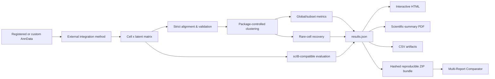

# scRareBench

**Rare-cell-aware, scIB-compatible benchmarking for single-cell RNA-seq integration latent spaces**

[](#what-is-new-in-0105)
[](#installation)
[](LICENSE)
[](#reproducibility-contract)

**Current release: `0.10.5`**

scRareBench is a method-independent research benchmark for evaluating integrated single-cell latent representations. It combines a conventional **scIB-compatible global integration layer** with an explicit **rare-cell preservation layer**, so a method cannot look successful only because large populations dominate the global score.

The package does **not** train integration models. scVI, MrVI, Harmony, or another method produces the latent representation; scRareBench evaluates that representation under one controlled benchmark contract.


## Developer-first high-level API

The recommended developer path is method-agnostic: **your code owns the integration method and its dependencies; scRareBench owns evaluation**. The high-level API can run any callable that returns one latent row per benchmark cell, while the low-level API remains available for complete control.

```python
from scrarebench import MethodSpec, benchmark_method, load_dataset

adata = load_dataset(0)

def run_my_method(adata, *, seed, config):
    # Install/import/train your own method here, then return the latent.
    latent = my_integration_method(adata, seed=seed, **config)
    return latent

method = MethodSpec(
    name="MyMethod",
    runner=run_my_method,
    config={"latent_dim": 30},
    # Optional and explicit; scRareBench never infers these from the method name.
    dependencies=(),
)

result = benchmark_method(
    adata,
    method,
    seeds=[42, 123, 2026],
    benchmark_config={"random_state": 42},
)
```

For a precomputed latent, `benchmark_latent(...)` remains the shortest interface. For custom datasets, call `register_dataset(...)` once to define label/batch/count metadata. See `HIGH_LEVEL_API.md` and `METHOD_INTEGRATION_GUIDE.md`, plus the generic `scRareBench_CustomMethod_HighLevel_Colab.ipynb` notebook.

### Seed contract

`method_seed` is the replicate dimension and may vary. `benchmark_seed` is part of the evaluation contract and stays fixed across method replicates. Multi-seed aggregation summarizes scalar/tabular metrics; latent coordinates, UMAPs and cluster assignments remain seed-specific and are never averaged.

> **Core question:** did integration remove unwanted technical variation *without erasing small, local, sporadic, or condition-specific biological populations?*

---

## What is new in 0.10.5

0.10.5 integrates the method-agnostic high-level developer API with multi-seed, provenance-hardened rare-cell benchmarking. It adds `MethodSpec` / `benchmark_method()`, user-controlled method dependencies and installers, generic Colab templates, and keeps the low-level latent/evaluation APIs for full control.

## What is new in 0.10.4

0.10.4 freezes the multi-seed scientific metrics while hardening provenance and resume safety. Method-training identity is now separate from the evaluation contract, benchmark randomness is an invariant across seed replicates, dataset/reference identity includes ordered labels/batches/scenarios/features, and final delivery cryptographically binds each report to its status, result bundle and latent. Changing only evaluation settings reuses a compatible cached latent but forces reevaluation; changing the training input or method configuration invalidates the latent cache. Structured scientific rows and stored aggregates are cross-seed/deep-validated before finalization.

- The six release notebooks hash the exact training matrix (canonical sparse CSR without densification, or dense bytes), ordered cells/features and relevant observation vectors before accepting a cached latent.
- A completed seed is skipped only when training identity, evaluation identity, report/bundle hashes and run-level provenance all agree; evaluation-only changes reuse a compatible latent and rebuild downstream artifacts.
- A change to evaluation annotations/reference identity (labels, batches, rare scenarios or feature identity) also invalidates completed evaluation artifacts; when the model training input itself is unchanged, the cached latent may still be reused safely.
- `BENCHMARK_SEED`/evaluation randomness is part of the compatible-run contract, while `method_seed` remains the intended replicate dimension. Conflicting benchmark-seed aliases fail closed.
- Finalization binds report ↔ status ↔ result bundle ↔ latent by run ID, method/dataset identity, training/evaluation hashes, dataset/reference contract, cell order and latent-array hash.
- Multi-seed finalization requires identical scientific row identities across seeds and deep-compares stored aggregates with a fresh recomputation before delivery.
- Current schema **1.6** records the stronger provenance contract; validated 0.10.0–0.10.3 artifacts can still be canonicalized for recovery without weakening current-run validation.
- `delivery_manifest.json` is re-read from the finished archive and every listed member is size/SHA256 checked before success is published.

---

## Why scRareBench?

Global integration metrics are necessary, but they can hide local biological failures. A latent space may obtain a good aggregate score while a low-frequency population is absorbed into a related abundant lineage.

scRareBench therefore reports three layers separately:

1. **Global biological conservation** — does the integrated latent retain meaningful biological structure?
2. **Batch correction** — is technical/sample variation reduced without replacing biology?
3. **Rare-cell preservation** — are curated rare populations still recoverable, pure enough, and not batch-fragmented?

No unvalidated “grand score” combines all three into one number.

---

## System architecture



The method boundary is intentionally narrow: **latent representation + exact cell alignment**. This keeps model-specific dependencies and preprocessing from silently changing the benchmark implementation.

---


## What was new in 0.10.3?

Release 0.10.3 is the final multi-seed reproducibility and presentation-hardening pass. It keeps the 0.10.2 scientific metric definitions and atomic delivery contract, while making report identity deterministic and removing UI encodings that could invite the wrong scientific conclusion.

- Multi-run containers are canonically sorted by method seed before aggregation, so import order no longer changes floating summation order or report identity.
- Categorical failure consensus now requires a strict majority (>50%); ties and pluralities without a majority are displayed as **No consensus**, while counts and top agreement remain available.
- Configuration hashing now deterministically serializes sets and NumPy arrays and reports contextual errors for unsupported objects.
- The six-scenario summary is a full-width six-column pivot instead of a 62-column table squeezed into a half-width panel; the complete raw 62-column CSV remains exportable.
- Single-run reports hide seed-aggregation duplication and UMAP small-multiple placeholders while retaining a dedicated Run & Provenance view.
- Seed Stability uses per-seed dots, an included-run mean line, and a ±1 sample-SD band on a data-scaled axis with explicit zoom disclosure.
- Multi-seed rare-population tables remove the structurally unavailable per-type full-space ASW field and place strict-majority failure consensus near the front.
- Comparator v9 renders mean rank as a dot plot with an explicit **1 = best** axis instead of bars whose length increased with worse rank; import status separately reports processed files and merged method × dataset groups.
- Wide tables now expose horizontal-scroll affordance, score formatting is consistent, and latent-delivery errors name the exact `include_latent` / `include_latents` contract needed to recover.

## What is new in 0.10.2?

Release 0.10.2 hardens the complete multi-seed delivery path. Multi-seed report merge, deep payload validation, summary creation, final ZIP creation, and ZIP re-validation are now one atomic package operation via `finalize_multiseed_delivery()`.

The finalizer rejects empty/truncated scientific payloads, mismatched point encodings, missing per-seed bundles/status files, missing requested latent files, incomplete expected seed sets, and corrupted ZIP members. It validates the exact standalone HTML bytes stored inside the final ZIP before publishing success.

All six Colab notebooks now use the package finalizer rather than hand-written export code. They fail loudly if final artifacts are missing, include validated per-seed reports/bundles/status files (and requested latents) in the final handoff ZIP, and no longer embed the large JavaScript dashboard directly into a Colab output cell because Colab sandboxing can make a valid standalone dashboard appear empty.

The 0.10.1 configuration-hash hotfix remains in place, including backward-compatible merge of already-generated 0.10.0 per-seed reports.

## What is new in 0.10.1?

Release 0.10.1 is the configuration-identity hotfix for the first multi-seed release. It fixes false incompatibility failures caused by seed-dependent realized clustering outcomes entering `configuration_hash`, and it can repair already-generated 0.10.0 per-seed reports at merge time without retraining. Requested scientific settings remain part of the hash; realized cluster counts and realized graph-degree outcomes do not.

## What is new in 0.10.0?

Release 0.10.0 introduced the native **N-seed run model** without changing the scientifically hardened rare-cell metric definitions introduced in 0.9.4–0.9.7. A method run carries first-class `method_seed`, `run_id`, seed-independent `configuration_hash`, and `dataset_fingerprint` provenance. Single-seed reports remain valid, while multiple compatible seed reports can be merged into one self-contained interactive workspace.

The interactive report supports aggregate **mean ± sample SD**, individual seed inspection, seed-stability diagnostics, small-multiple UMAPs, per-population failure-archetype consensus/agreement, dynamic import of compatible seed reports, non-destructive exclude/restore from aggregate statistics, duplicate-seed prevention, and portable **Save Updated Report** persistence. Embeddings, UMAP coordinates, Leiden cluster identities and Sankey flows are deliberately never averaged across seeds.

All six Colab notebooks accept either a scalar `METHOD_SEED` or a list such as `[42, 123, 2026]`. They checkpoint each seed independently, keep `BENCHMARK_SEED` fixed, validate each completed seed before starting the next one, support resumable reruns, and finally build one self-contained multi-seed handoff. Results/bundle schema 1.5 was introduced with this run model; the current 0.10.4 release writes schema 1.6.

## What is new in 0.9.7?

Release 0.9.7 is the final export-consistency and release-polish pass on top of the scientifically hardened 0.9.6 core. No rare-recovery definition or v2 classification rule is changed. The release makes the resolution-aware interpretation fully available to CSV/downstream workflows, keeps every historical metric/taxonomy field for backward comparison, and synchronizes the package, comparator, notebooks, schemas, documentation and wheel.

### Scientific additions

- Historical majority-vote precision/recall/F1 are retained and explicitly labeled as **resolution-dependent cluster-label-transfer diagnostics**.
- Added **support-adjusted kNN Local Recovery** as the primary local metric. It corrects the support-dependent ceiling of the raw v0.9.4 score, so a perfectly isolated population can reach 1.0 even when its support is smaller than the realized graph degree.
- Retained the raw v0.9.4 `knn_local_recovery` as a **context-only, support-limited legacy diagnostic**, together with the observed same-label fraction, abundance null and achievable ceiling.
- Added **best-cluster precision/recall/F1**, which measures whether any discovered cluster captures a population well without requiring that the population win majority ownership of that cluster.
- Added **full-space selected-cell ASW** alongside the historical within-subset ASW, so rare cells are evaluated against abundant competitors rather than only against other rare cells.
- Added a stored **Leiden resolution sensitivity** table while keeping the reference resolution fixed; scRareBench does not tune resolution using the number of ground-truth labels.
- Fixed measured-zero `preserved_fraction`, global-rarity gating for inferred GR/LE/SR classes, silhouette seed propagation, and canonical count-layer validation.
- Exact Leiden `flavor`, `n_iterations`, resolution and seed are now part of the reproducibility contract; no silent clustering implementation fallback remains.
- The historical failure taxonomy is retained unchanged in `failure_archetype` and related legacy columns.
- Added an additive **resolution-aware v2 taxonomy** in `failure_archetype_v2`. A legacy `lineage_assimilation` match becomes primary `resolution_limited` in v2 only when support-adjusted local recovery and dominant-cluster capture remain high. The underlying legacy assimilation match is still preserved for auditability.
- Scenario validation now occurs **before filtering**. In strict/canonical mode, an invalid code such as `GR-DI` fails closed instead of silently dropping the population. Exploratory mode records the exact invalid rows/codes before dropping them.
- kNN graph provenance and per-cell adjusted recovery use the same **non-self neighbor definition**, including for third-party graphs that contain diagonal/self-loop entries.
- Singleton populations keep `knn_local_recovery_adjusted = NaN` because the support-adjusted ceiling is undefined at support 1; the UI explicitly labels this as **Not assessable — singleton**, never as zero.

### Interactive evidence layer

- live failure-threshold sensitivity sliders;
- resolution-sensitivity inspection per rare population;
- optional marker-gene expression overlay on UMAP;
- lasso/box selection with CSV cell-barcode export;
- an explicitly non-canonical what-if sandbox for stored-resolution changes, batch exclusion and label merging;
- plain-language metric glossary and stronger interpretation warnings;
- compact binary encoding for UMAP/category payloads;
- dashboard CSS/JS/template split into package assets for maintainability while the delivered HTML remains self-contained.

### Reproducibility / comparison

- `rare_metrics_summary.csv` now exports **`resolution_limited_fraction`** as context-only diagnostic metadata; it does not mean preserved.
- `scenario_metrics.csv` now exports the resolution-aware v2 archetype **counts and fractions for every canonical scenario slot**, making the six-scenario CSV self-contained for downstream manuscript analysis.
- current `results.json` and result-bundle schema **1.6** (Comparator v9 retains legacy schema 1.1–1.5 import compatibility);
- Comparator **v8** adds native multi-seed grouping/aggregation while preserving direction-aware ranking and refusing to auto-rank context-only quantities;
- PDF summaries prioritize full-space ASW, local recovery, best-cluster recovery and resolution sensitivity while retaining historical values;
- expanded adversarial tests target the rare-cell failure modes that the benchmark is intended to detect.

See [CHANGELOG.md](CHANGELOG.md) for the release history.

---

# Interactive HTML report

The self-contained HTML report is best understood as a **scientific handoff artifact**: a bioinformatician generates the benchmark result, then a biologist, collaborator, reviewer or PI can inspect the evidence in a browser with **no Python environment, no server and no installation**. The screenshots below document the current interface; the v0.10.4 release is additionally browser-validated against current schema-1.6 single- and multi-seed fixtures and demonstrate the report UI; no example-result bundle is shipped with the project.

The interface is not presented as the scientific novelty by itself. The contribution is the rare-population diagnostic framework; the report makes the evidence behind each diagnosis inspectable rather than asking the reader to trust a summary label.


The canonical report contains:

- **Overview** — benchmark identity, cells/batches/cell types, reference-cluster count, cluster-count warning, scIB aggregates and rare-recovery summary.
- **Metrics** — historical overall/rare/non-rare values **plus** the new full-space selected-cell ASW.
- **scIB** — individual standard metrics, Bio conservation / Batch correction aggregates, status/applicability and reference configuration.
- **Rare-cell Explorer** — historical majority-vote metrics, support-adjusted + raw kNN local recovery, best-cluster recovery, scenario metadata, primary + matched failure archetypes and population-level drill-down.
- **UMAP** — true label, batch, scenario, cluster, prediction and failure views; optional marker-gene coloring; lasso/box cell selection and barcode export. If UMAP generation fails, the UI visibly labels the fallback as latent dimensions 1–2 instead of silently presenting it as UMAP.
- **Sankey** — true-label → cluster → prediction / failure flow inspection.
- **Reproducibility** — benchmark configuration, exact Leiden implementation, failure rules and runtime/package metadata.
- **Figures** — generated static figures when requested.
- **Seed Stability** — mean ± sample SD, per-seed traces, rare-population consensus/agreement, resolution-sensitivity traces and UMAP small multiples; UMAP coordinates are never averaged.
- **Runs & Seeds** — inspect any stored seed, include/exclude runs from aggregate display without deleting data, import compatible reports, reject duplicate seeds/configuration mismatches, and save the updated self-contained workspace.

### Canonical result vs exploratory UI

Canonical benchmark scores are immutable inside the report. Exploratory controls are visibly separated from reported results:

- **Failure-threshold sensitivity:** sliders reclassify provisional failure rules client-side to show how conclusions change around threshold choices.
- **Resolution sensitivity:** uses clustering results already generated by the benchmark sweep; it does not choose a new canonical resolution.
- **What-if sandbox:** label merge, batch exclusion and stored-resolution selection recompute exploratory contingency-table metrics in-browser and are explicitly marked **not canonical**.

None of these controls overwrite `results.json`, CSV files or the reported benchmark score.


### Marker-gene overlay

The report can optionally embed a small user-specified marker panel (up to 50 genes by default). Expression vectors are quantized for compact browser delivery. This is intended for **visual biological checking**, not differential-expression inference. Missing requested genes are skipped automatically.

### Cell handoff

Plotly lasso/box selection can export selected cells as CSV, including cell ID and available label/batch/scenario/cluster/prediction/failure/local-recovery fields. This makes a suspicious region directly transferable back to downstream analysis.

Major plots retain PNG export. The complete report remains a single offline HTML file.

## Multi-Report Comparator

The standalone file `comparator/scRareBench_Multi_Report_Comparator_v9.html` compares multiple method/dataset runs directly in the browser. It supports:

- current v0.10.4 `results.json` (schema 1.6), including training/evaluation/dataset-contract provenance, plus legacy schema 1.1–1.5 inputs;
- complete scRareBench result ZIPs;
- legacy self-contained scRareBench HTML reports.

The comparator provides method-on-dataset and dataset-on-method views, arbitrary X/Y metric plots, rare-cell deep dives, coverage-aware ranking, strict common-dataset ranking, metric-direction-aware Pareto analysis, and high-resolution PNG export. It accepts multi-seed HTML directly, can switch between aggregate/individual/specific-seed views, reports seed completeness and uses mean ± sample SD/error bars where appropriate. Missing method–dataset combinations remain missing rather than being converted to zero.

---

# Installation

## Recommended: install the release wheel

```bash
pip install dist/scrarebench-0.10.5-py3-none-any.whl
```

## Install from source

```bash
pip install .
```

For development/testing:

```bash
pip install -e ".[dev]"
```

The current package metadata requires Python `>=3.11`.

---

# Quick start

## 1. Load a registered dataset

```python
from scrarebench.datasets import load_dataset

adata = load_dataset(0, data_dir="./data")
```

List registry entries from the CLI:

```bash
scrarebench datasets
```

## 2. Train your integration method externally

Generate a cell-by-latent matrix using scVI, MrVI, Harmony or another method. scRareBench intentionally does not install or control the method implementation.

## 3. Attach the latent with strict alignment

```python
from scrarebench.latent import attach_latent

alignment = attach_latent(
    adata,
    X_latent,
    key="X_my_method",
    latent_barcodes=barcodes,
    allow_reorder=False,
    overwrite=True,
)

print(alignment)
```

A valid latent must be 2D, contain exactly one row per benchmark cell, and contain only finite values. When barcodes are supplied, identity/order is verified rather than inferred from shape.

## 4. Evaluate under the fixed benchmark contract

```python
from scrarebench.evaluation import EvaluationConfig, evaluate_latent
from scrarebench.scib_backend import ScibEvaluationConfig

config = EvaluationConfig(
    method_name="MyMethod",
    representation_key="X_my_method",
    label_key="celltype",
    batch_key="BATCH",
    random_state=42,
    scib=ScibEvaluationConfig(
        enabled=True,
        count_layer="counts",
        n_hvg=4000,
        canonical=True,
        allow_hvg_fallback=False,
        require_backend=True,
    ),
)

result = evaluate_latent(
    adata,
    config,
    "./results/MyMethod",
)
```

## 5. Create a reproducible result bundle

```python
from scrarebench.reporting import create_report_bundle

create_report_bundle(
    adata,
    result,
    "./MyMethod_scRareBench_results.zip",
    representation_key="X_my_method",
    include_latent=True,
    label_key="celltype",
    batch_key="BATCH",
)
```

---

# Reproducibility contract

## Benchmark seed

The canonical evaluation seed in v0.10.4 remains:

```text
BENCHMARK_SEED = 42
```

Method training randomness is conceptually separate:

```python
METHOD_SEED = 42       # training / method implementation
BENCHMARK_SEED = 42    # fixed scRareBench evaluation contract
```

The shipped multi-seed notebooks keep `BENCHMARK_SEED=42` and `PREPROCESSING_SEED=42` fixed while allowing `METHOD_SEED` to be either a scalar or an arbitrary unique list such as `[42, 123, 2026]`. This isolates integration-method stochasticity from preprocessing and evaluation randomness.

## Package-controlled clustering

Reference benchmark settings:

- kNN neighbors: `15`
- distance: Euclidean
- Leiden reference resolution: `1.0`
- benchmark seed: `42`

Resolution sweeps may be requested, but the reference resolution remains explicit.

## Missing is not zero

A missing metric, rare population, scenario, or method×dataset run remains **missing**. scRareBench does not impute an untested combination as score 0.

This rule is also enforced by the comparator’s coverage/ranking views.

---

# Rare-cell benchmark model

For datasets with curated scenario metadata, scRareBench uses six scenario slots:

| Scenario | Distribution | Topology |
|---|---|---|
| `GR-DL` | Globally Rare | Distinct Lineage |
| `GR-RM` | Globally Rare | Related / Mixed manifold |
| `LE-DL` | Locally Enriched | Distinct Lineage |
| `LE-RM` | Locally Enriched | Related / Mixed manifold |
| `SR-DL` | Sporadic Rare | Distinct Lineage |
| `SR-RM` | Sporadic Rare | Related / Mixed manifold |

A dataset does not need to populate every slot. Empty scenarios remain explicit in reports.

## Safe scenario policy

Resolution order in v0.10.4:

1. `scenario_table=` passed explicitly;
2. dataset-specific scenario table embedded/registered in the loaded AnnData;
3. otherwise raise a clear error.

For a dataset without a curated rare taxonomy, standard evaluation can still be run with:

```python
EvaluationConfig(..., rare_evaluation=False)
```


### Strict scenario-label drift policy

Canonical rare-cell evaluation is fail-closed when a curated scenario table names a cell type that is absent from the loaded data **or uses a scenario code outside the six registered values**. Validation occurs before invalid-code filtering, so a typo cannot silently remove a real population. For exploratory inspection only, set `strict_scenario_labels=False` (CLI: `--allow-scenario-label-drift`); absent labels plus invalid scenario rows/codes are then recorded in `rare_evaluation_status.json` and `results.json`.

The legacy GSE194122 paper-table fallback is available **only through explicit opt-in**:

```python
EvaluationConfig(..., scenario_policy="paper_fallback")
```

It should not be used for unrelated datasets.

---

# Metrics

scRareBench 0.10.4 intentionally reports **complementary views** of rare recovery rather than replacing historical metrics with one new score.

## Historical global/subset metrics — retained

The standard subset table still reports the established fields where applicable:

- `ASW_true_on_latent`;
- `ARI_true_vs_cluster`;
- `AMI_true_vs_cluster`;
- `Accuracy`;
- `F1_macro`;
- `F1_weighted`;
- `G_Mean`.

Rows remain:

```text
overall
rare
non_rare
```

For backward compatibility, the rare-row historical ASW still describes geometry **within the rare subset**. It is now accompanied by a second metric designed for the absorption question.

## Full-space selected-cell ASW — new, additive

`ASW_selected_cells_in_full_latent` computes silhouette values with **all cells present**, then averages the values belonging to the selected subset. For the rare row, abundant neighboring lineages therefore remain competitors.

This distinguishes two questions:

- `ASW_true_on_latent` on the rare subset: *are rare types separated from one another?*
- `ASW_selected_cells_in_full_latent`: *are rare cells separated from their relevant full-dataset competitors?*

The first is retained; the second is preferred when discussing rare-population absorption.

## Historical majority-vote rare precision/recall/F1 — retained

The original per-type `precision`, `recall` and `f1` are still produced. They use package-controlled Leiden clusters followed by cluster → majority-label transfer.

They answer a useful but resolution-dependent question:

> Can the population be recovered as a majority-labelled cluster at this clustering resolution?

They should **not** be interpreted as a resolution-free proof that a population disappeared from the latent space. In particular, when the number of discovered clusters is lower than the number of true cell types, some types cannot own a majority-labelled cluster. The report therefore displays `n_clusters` and `n_cell_types` prominently and warns when `n_clusters < n_cell_types`.

## Best-cluster recovery — new, additive

For each cell type, scRareBench also searches the discovered clusters for the cluster that best captures that type and reports:

- `best_cluster_precision`;
- `best_cluster_recall`;
- `best_cluster_f1`.

This does **not** require the type to win the majority vote of the cluster. It remains clustering/resolution dependent, but removes the structural majority-ownership ceiling from the diagnostic.

## kNN Local Recovery — support-adjusted primary metric

For each cell, scRareBench examines the package-controlled latent-space kNN graph. For a cell type \(c\):

- \(p_{obs}\) = mean fraction of graph neighbors sharing label \(c\);
- \(p_{null}\) = expected same-label fraction from global abundance, excluding the query cell;
- \(p_{max}\) = maximum same-label fraction achievable given the population support and the **realized graph degree**.

The raw historical v0.9.4 score is retained:

\[
R_{raw}=\frac{p_{obs}-p_{null}}{1-p_{null}}
\]

For a population with support \(s\) and a cell with graph degree \(d\), however, there are at most \(s-1\) same-label peers available. Therefore the same-label fraction cannot exceed:

\[
p_{max,i}=\frac{\min(s-1,d_i)}{d_i}
\]

scRareBench 0.9.7 keeps the support-adjusted score primary:

\[
R_{adjusted}=\frac{p_{obs}-p_{null}}{p_{max}-p_{null}}
\]

Interpretation:

- **1** — reaches the maximum local coherence achievable for that support/graph degree;
- **0** — no enrichment above the abundance-null expectation;
- **< 0** — below-null same-label neighborhoods;
- **NaN / not assessable** — the adjusted denominator is undefined, e.g. a singleton population.

Output columns include:

- `knn_local_recovery_adjusted` — **primary**, maximize;
- `knn_local_recovery` — raw historical/support-limited value, context only;
- `knn_same_label_fraction` — observed neighborhood fraction;
- `knn_expected_fraction` — abundance-null expectation;
- `knn_max_achievable_fraction` — support/degree ceiling;
- `knn_mean_neighbors` and `knn_valid_cells` — graph/coverage provenance.

The metric is **independent of the Leiden resolution sweep**, not independent of every graph choice. The run manifest therefore records the kNN graph source, requested neighbor count, and realized mean/min/max degree. This wording is intentionally more precise than calling the metric simply “resolution-free.”

The adjusted score is designed for method, population, scenario and dataset comparisons; the raw score remains visible so v0.9.4 results can still be interpreted. Support adjustment removes the deterministic ceiling at the null/perfect endpoints, but extremely small populations still contain less information and therefore have lower discrimination at intermediate recovery levels. Always interpret the adjusted score together with `support`, `knn_max_achievable_fraction`, and `knn_valid_cells`.

## Inverse purity and batch dependence

Existing cluster-based diagnostics remain available, including:

- `inverse_purity` / dominant-cluster capture;
- `within_type_batch_nmi`;
- `dominant_wrong_fraction`;
- cluster count / assignment diagnostics.

`inverse_purity` remains particularly useful because it does not depend on whether the population wins cluster majority ownership.

## Resolution sensitivity

The canonical reference resolution remains fixed. A configurable sweep (release notebooks use `0.5, 0.75, 1.0, 1.25, 1.5, 2.0`) is saved separately for sensitivity inspection. scRareBench does **not** tune resolution until `n_clusters ≈ n_cell_types`, because that would use ground-truth label cardinality to choose an evaluation hyperparameter.

## Failure archetypes

scRareBench now exposes **two simultaneous views** rather than rewriting history:

- `failure_archetype` / `failure_matched_archetypes` — frozen legacy majority-vote taxonomy for backward comparison;
- `failure_archetype_v2` / `failure_matched_archetypes_v2` — primary resolution-aware interpretation used by the current dashboard.

The v2 taxonomy adds `resolution_limited` ahead of legacy `lineage_assimilation`. The guard activates only when the legacy assimilation rule fires **and** support-adjusted kNN local recovery plus dominant-cluster capture remain high. This means “majority-vote label transfer failed at this clustering resolution” is not automatically narrated as “the integration destroyed this population.” The legacy match remains stored even when v2 chooses `resolution_limited`.

All thresholds remain provisional and are exposed in the interactive sensitivity lab. The dashboard shows both the v2 and legacy labels in population details, and the result JSON records both precedence contracts.

## Ratio diagnostics are separate

`non_rare / rare` ratios remain in:

```text
subset_metric_ratios.csv
```

When the denominator is effectively zero, the ratio is `null`/`NaN` with `status = unstable_denominator` rather than an extreme number.

# Metric direction registry

Not all diagnostic quantities should be maximized. v0.9.7 stores metric semantics explicitly.

Examples:

| Metric | Direction |
|---|---|
| F1 / ARI / AMI | maximize ↑ |
| Bio conservation | maximize ↑ |
| Batch correction | maximize ↑ |
| scIB Total | maximize ↑ |
| inverse purity / capture | maximize ↑ |
| kNN Local Recovery — support-adjusted | maximize ↑ |
| kNN Local Recovery — raw/support-limited | context ↔ |
| kNN achievable ceiling / graph degree | context ↔ |
| Legacy preserved-rule fraction | context ↔ |
| Resolution-limited fraction (v2) | context ↔ |
| best-cluster F1 | maximize ↑ |
| kNN expected fraction | context ↔ |
| within-type batch NMI | minimize ↓ |
| dominant wrong fraction | minimize ↓ |

The registry is included in `results.json` and written to the reproducibility output. Comparator v8 consumes this metadata for ranking, “Best X/Y”, and Pareto calculations. Axis direction can still be manually overridden for an intentional alternative interpretation.

---

# scIB-compatible evaluation

scRareBench uses the pinned `scib-metrics==0.5.9` layer defined by the project dependencies. The submitted method latent is **never re-integrated** by scRareBench.

## Canonical reference preprocessing

The benchmark-only reference is constructed independently from counts. Default policy:

- GEX counts from the configured count layer;
- 4,000 HVGs unless dataset policy overrides;
- normalize total to 10,000;
- log1p;
- PCA up to 50 components.

### Fail-closed canonical mode

For publication/reference comparisons:

```python
ScibEvaluationConfig(
    canonical=True,
    allow_hvg_fallback=False,
)
```

If canonical Seurat-v3 HVG computation is unavailable, evaluation fails rather than silently switching algorithms.

Exploratory fallback requires explicit opt-in:

```python
ScibEvaluationConfig(
    canonical=False,
    allow_hvg_fallback=True,
)
```

The reference configuration records whether a fallback occurred.

## Optional backend failures remain auditable

With `require_backend=False`, an scIB backend error may be non-fatal, but it is still written to:

```text
scib/scib_status.json
```

including status, exception type and message.

---

# Registered datasets

The current registry exposes six stable selectors.

| Index | Key | Dataset / role |
|---:|---|---|
| 0 | `gse194122` | GSE194122 paper benchmark |
| 1 | `gse194122_raw` | original/unmodified GSE194122 source |
| 2 | `mbdrc_renal_cortex` | mBDRC renal cortex |
| 3 | `wu_breast_cancer_atlas` | Wu breast-cancer atlas |
| 4 | `covid19_autoimmunity_pbmc` | COVID-19 autoimmunity PBMC |
| 5 | `nygc_seurat_v4_pbmc` | NYGC / Seurat v4 CITE-seq PBMC |

Dataset provenance is attached under:

```python
adata.uns["scrarebench_dataset"]
```

where available it records selector/key, source URL or collection ID, accession, local path, source-file SHA256 and whether scRareBench performs benchmark-specific cell editing.

Formal manuscript citation should still use each dataset’s original publication/database record.

---

# Machine-readable result contract

The preferred downstream interface is:

```text
benchmark_results/results.json
```

Schema version: **1.6**.

The payload includes:

- generating package/schema version;
- method and representation identity;
- dataset provenance;
- benchmark dimensions and seed/config;
- subset metrics and separate ratio diagnostics;
- per-type and rare-cell rows;
- six-scenario summary, including v2 archetype counts/fractions per canonical scenario;
- rare summary including context-only `resolution_limited_fraction`;
- rare/scIB execution status;
- scIB metric values/aggregates/reference config;
- metric direction registry;
- cell-order SHA256;
- latent shape, dtype and SHA256.

JSON is strict: legitimate unavailable numeric values are represented as `null`, not non-standard `NaN`/`Infinity` tokens.

---

# Result bundle structure

A v0.10.4 single-run bundle is organized as:

```text
scrarebench_bundle/
├── README.md
├── bundle_manifest.json
├── artifact_hashes.json
├── benchmark_results/
│   ├── results.json
│   ├── subset_metrics.csv
│   ├── subset_metric_ratios.csv
│   ├── per_type_metrics.csv
│   ├── report.html
│   ├── clustering/
│   ├── rare_cell/
│   ├── scib/
│   └── reproducibility/
├── reports/
│   ├── interactive_report.html
│   └── summary_report.pdf
├── reproducibility/
│   ├── dataset_manifest.json
│   └── method/
└── latent/                 # optional
    ├── <representation>_latent.npy
    └── <representation>_barcodes.npy
```

### Artifact hashes

`artifact_hashes.json` contains SHA256 and file-size information so a frozen result can be audited for accidental changes.

### Pickle-free barcodes

Barcodes are saved as NumPy Unicode arrays with:

```python
allow_pickle=False
```

so ordinary cell IDs do not require Python-object serialization.

### Method provenance

`create_report_bundle()` accepts method-specific artifacts:

```python
extra_provenance_files={
    "method_config": path_to_config,
    "selected_hvgs": path_to_hvgs,
    "training_history": path_to_history,
    "model_manifest": path_to_manifest,
}
```

Existing files are copied under `reproducibility/method/`.

### Multi-seed handoff

Each method seed remains an independent auditable run/bundle. Compatible per-seed interactive reports can be merged into one self-contained N-seed HTML workspace. Aggregate numeric metrics use the mean and **sample SD (`ddof=1`)** across included seeds; when only one seed contributes, SD is missing/not-applicable rather than zero. Excluding a seed changes only the aggregate display state: its complete run remains stored and inspectable.


---

# Reports

## Interactive HTML

The HTML report is the primary exploratory interface. Depending on included data it provides:

- Overview;
- Metrics;
- scIB;
- Rare-cell Explorer;
- UMAP;
- Sankey;
- Reproducibility;
- Figures.

Tables support filtering/sorting/export, and interactive views are linked where possible.

## PDF summary

The v0.10.4 PDF is intentionally a **scientific summary**, not a printout of every raw column. Wide raw tables remain in CSV/HTML where they are actually readable.

The summary focuses on:

- core/subset metrics;
- ratio diagnostics;
- rare summary and six scenarios;
- strongest/weakest rare populations;
- failure distribution;
- scIB aggregates/selected metrics;
- key figures;
- reproducibility/execution status.

---

# Multi-Report Comparator v9

Release path:

```text
comparator/scRareBench_Multi_Report_Comparator_v9.html
```

The comparator is standalone/client-side and requires no server for normal use.

## Import priority

1. complete v0.10.4 result ZIP (including multi-seed handoff ZIPs that contain per-seed bundles and a merged report);
2. current schema-1.6 `results.json` (legacy schema 1.1–1.5 remains importable);
3. legacy self-contained scRareBench HTML;
4. legacy ZIP with a compatible interactive HTML fallback.

For large benchmark collections, JSON/ZIP import is preferred over parsing multi-megabyte presentation HTML.

## Views

- **Methods on Dataset** — multiple methods on one dataset;
- **Datasets for Method** — one method across datasets;
- **Metric Plotter** — arbitrary X/Y/bubble metrics with direction-aware Pareto frontier;
- **Rare-cell Deep Dive** — uses support-adjusted kNN recovery by default and retains raw kNN/best-cluster/historical diagnostics while preserving historical F1/precision/recall;
- **Coverage & Ranking** — benchmark completeness is shown separately from performance.

Ranking supports both **All available datasets** and **Strict common datasets only**. Missing method–dataset runs are never converted to zero.

The comparator consumes metric direction from the result registry. A `context` metric is deliberately **not auto-ranked**; the UI asks for an explicit interpretation rather than silently treating it as higher-is-better. Pareto analysis follows maximize/minimize directions and remains an optional visualization, not a regression line.

All major plots retain high-resolution PNG export.

# CLI

List registered datasets:

```bash
scrarebench datasets
```

Download/prepare a registered dataset:

```bash
scrarebench download-dataset 0 --data-dir ./data
```

Evaluate an attached latent:

```bash
scrarebench evaluate \
  --adata ./data/benchmark.h5ad \
  --latent ./latent.npy \
  --latent-barcodes ./barcodes.npy \
  --method MyMethod \
  --output-dir ./results/MyMethod \
  --label-key celltype \
  --batch-key BATCH
```

Explicit safety switches include:

```text
--skip-rare
--allow-paper-scenario-fallback
--skip-scib
--allow-scib-failure
--allow-noncanonical-hvg-fallback
```

Fallback flags are opt-ins; they are not recommended for canonical manuscript comparisons without a documented reason.

---

# Colab notebooks

The release ships method-specific notebooks for Harmony, MrVI and scVI on the currently prepared Dataset 0 / Dataset 2 workflows.

Release notebooks:

- require scRareBench `0.10.4`;
- accept a scalar or list-valued `METHOD_SEED`, while keeping `BENCHMARK_SEED` and preprocessing randomness fixed;
- run requested seeds sequentially with resumable per-seed checkpoints and exact cell alignment;
- use Unicode/pickle-free barcode cache files;
- validate each latent before evaluation, package every completed seed independently, and then build a self-contained N-seed HTML report;
- contain no stale execution outputs in the clean release copy;
- evaluate a six-point stored Leiden resolution sweep for sensitivity analysis;
- embed a small dataset-appropriate marker panel into the interactive handoff report when those genes are present.

---

# Example-output policy

To keep the project package small, the release does **not** include a full benchmark-result ZIP or a multi-megabyte self-contained example HTML. The screenshots above document the interactive interface; the v0.10.4 release is additionally browser-validated with current single-seed, multi-seed, legacy-recovery and Comparator v9 fixtures. The screenshots are included only to document the interactive interface.

A normal scRareBench run can generate:

```text
scrarebench_bundle/
├── README.md
├── bundle_manifest.json
├── artifact_hashes.json
├── benchmark_results/
│   ├── results.json
│   ├── subset_metrics.csv
│   ├── subset_metric_ratios.csv
│   ├── per_type_metrics.csv
│   ├── rare_cell/
│   ├── scib/
│   └── reproducibility/
├── reports/
│   ├── interactive_report.html
│   └── summary_report.pdf
└── latent/                     # optional
    ├── <representation>_latent.npy
    └── <representation>_barcodes.npy
```

`results.json` is the preferred machine-readable input for automated comparison, while the HTML report is intended for interactive inspection.

---

# Validation

The release is validated at multiple layers rather than only importing the package.

Validation includes:

- source unit/regression/integration tests;
- Python compile check;
- notebook nbformat and code-cell syntax checks;
- wheel build and isolated smoke import;
- CLI dataset-registry smoke test;
- comparator JavaScript syntax check;
- browser/parser smoke checks for the interactive report and comparator;
- source/wheel import and packaging consistency checks.

---

# Development

Run tests:

```bash
PYTHONPATH=src pytest -q
```

Run coverage:

```bash
coverage run --source=src/scrarebench -m pytest -q
coverage report -m
```

Compile all package Python modules:

```bash
python -m compileall -q src/scrarebench
```

Build the wheel:

```bash
python -m pip wheel . --no-deps --no-build-isolation -w dist
```

---

# Design boundaries

scRareBench intentionally does **not**:

- train or tune integration models;
- silently reorder cells;
- replace missing values with zero;
- silently reuse another dataset’s rare-cell taxonomy;
- silently switch canonical HVG algorithms;
- collapse standard and rare-cell layers into an unvalidated total score;
- claim diagnostic failure thresholds are universal biological truth.

The benchmark invariants are summarized in this README and encoded by the regression tests.

---

# Current limitations

- External-dataset rare topology is curated/research-facing and should be re-audited if source annotations change.
- Failure-archetype thresholds remain provisional and require sensitivity analysis for manuscript claims.
- kNN Local Recovery depends on the benchmark neighbor-graph definition (`k=15` in the canonical contract); sensitivity to neighborhood size should be reported if it becomes a central biological claim.
- Failure-archetype thresholds remain provisional; the dashboard now exposes threshold sensitivity, but manuscript claims should still document the canonical rule set.
- Formal multi-seed statistics are not yet a first-class comparator dimension; one imported report currently represents one method×dataset run.
- Some scIB metrics require information that cannot be inferred from a latent-only submission and remain explicitly not applicable.
- Self-contained HTML reports may be large; `results.json`/ZIP is the scalable comparison interface.

---

# Recommended publication workflow

1. freeze dataset source/version and record source hashes;
2. keep method training configuration and `METHOD_SEED`;
3. attach each latent with exact barcode validation;
4. evaluate every method with the same `BENCHMARK_SEED`;
5. keep canonical scIB preprocessing fail-closed;
6. preserve method-specific provenance in every result bundle;
7. inspect coverage before ranking methods;
8. inspect kNN local recovery, full-space rare ASW and historical cluster-label metrics together rather than relying on one number;
9. inspect resolution and failure-threshold sensitivity for central rare-cell claims;
10. use strict common-dataset ranking for paired claims;
11. archive the exact result ZIPs and SHA256 manifest referenced by the manuscript.

---

# Citation

A synchronized [`CITATION.cff`](CITATION.cff) is included with the release. When using the standard benchmark layer, also cite scIB/scib-metrics as appropriate; when using registered biological datasets, cite their original publication/database source.

---

# License

MIT License — see [LICENSE](LICENSE).

---


# Release 0.10.1

`0.10.1` is a beta/research release that adds native N-seed execution, provenance, aggregation, interactive report management and comparator support on top of the unchanged 0.9.7 rare-cell scientific core. Results/bundle schema is `1.5` and the standalone comparator is v8. Single-seed workflows remain supported; sample SD is not fabricated as zero for one seed, and excluded runs remain stored/inspectable rather than being deleted.

# Release 0.9.7

`0.9.7` is a **beta/research release** focused on scientifically robust rare-population diagnostics, auditable evidence and export consistency. It preserves all historical metrics/taxonomy columns, uses support-adjusted kNN recovery as the primary local-recovery endpoint, retains the additive resolution-aware v2 interpretation layer, fails closed on invalid scenario codes/annotation drift, aligns graph provenance with the metric denominator, and exports v2 resolution-limited/scenario context consistently to CSV. Curated scenario assignments, the legacy preserved-rule outcome, and failure thresholds remain research-facing/provisional components rather than universal biological standards.
